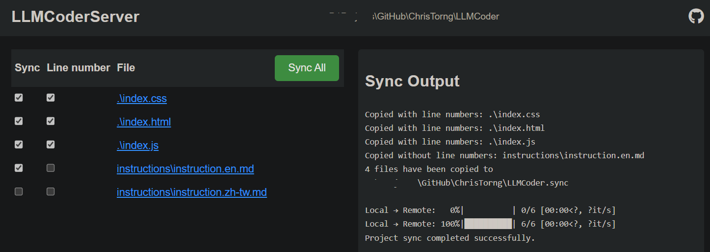

# LLMCoderSync

Work with [ClaudeSync](https://github.com/jahwag/ClaudeSync) and [LLMCoder](https://github.com/ChrisTorng/LLMCoder) for easy Claude project coding experience.


The WebUI shows all files, excludes `.gitignore` and `.claudesync`. You choose which files to be synced with or without line number. Then press `Sync All` button to sync to target Claude project, with the help from [ClaudeSync](https://github.com/jahwag/ClaudeSync).

You can modify your `SyncCommand` file for your sync tools, not limited to `LLMCoderSync` and `ClaudeSync`.

You can easily choose the currently working files to sync, save more tokens from Claude usage for longer conversations.

The line number options is used for [LLMCoder](https://github.com/ChrisTorng/LLMCoder), it uses code with line numbers and ask LLM to use specific JSON diff output, then apply the JSON diff to the source code. It helps you sync the output of LLM back to your source code with only one paste action, and save the output tokens for only diff part.

# Build & Usage

```
pip install flask pyinstaller
pyinstaller LLMCoderSync.spec
pyinstaller LLMCoderServer.spec
```

Run `/path/to/LLMCoderSync/dist/LLMCoderServer/LLMCoderServer` from your project dir `current`, open http://localhost:5000 for WebUI. Check all the codes that needs to be synced. If your are not using [LLMCoder](https://github.com/ChrisTorng/LLMCoder), you should uncheck all line numbers.

Run `/path/to/LLMCoderSync/dist/LLMCoderSync` to copy `current` dir into another `current.sync` dir, for all files synced, with specific line numberred files to sync to LLM (I'm using Claude).

While `claudesync project select`, select the project dir to `current.sync`.

Then you can click `Sync All` button to run `SyncCommand`, make sure the sync is working.

# Working with [LLMCoder](https://github.com/ChrisTorng/LLMCoder)

Copy `instructions\instruction.en.md` into your project dir and sync to Claude, without line number. Other code files should apply line numbers.

Set Claude's Project custom instructions like this:

```
Please provide concise and brief answers unless detailed explanations are requested.
For any response involving modifications to existing code, strictly follow the instructions in instruction.en.md.
All codes should be obtained directly from the uploaded files in the Project, without referencing recent modification results.
```

Ask Claude to modify code, it should follow the instructions, output JSON diff.

On [LLMCoder online page](https://christorng.github.io/LLMCoder/), paste the source code, then paste the JSON, it will apply the changes to the source and copy to clipboard automatically. You can paste back to overwrite to your source.

Click `Sync All` button on WebUI after each time the codes are modified, ready for the next prompt to reference the latest code with line numbers.

# Future plan

* **Integrate LLMCoder into LLMCoderSync WebUI**: So you can select a code file, paste JSON, then it write the result directly into the source, saves you more time.
* **Use Markdown instead of JSON**: not only saves more tokens, but avoid escape char problems like forgetting to use \\" in JSON.
* **Apply multiple files at once**: Ask LLM to add file names in JSON/Markdown diff, then it can modify them all at once.
* **Fix Off-by-One Errors automatically**: sometimes the LLM output wrong first line number. It tries to look for correct line number and apply without manual fix.